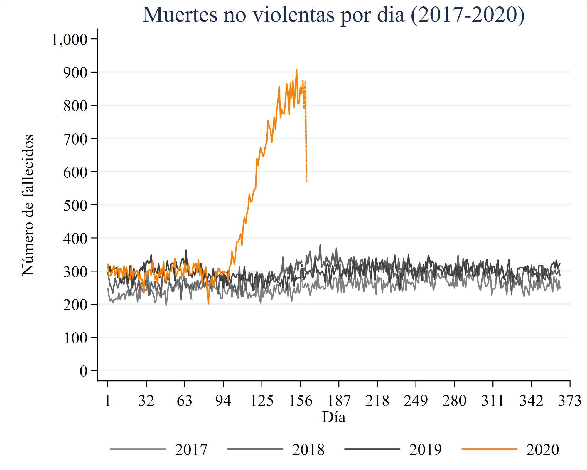
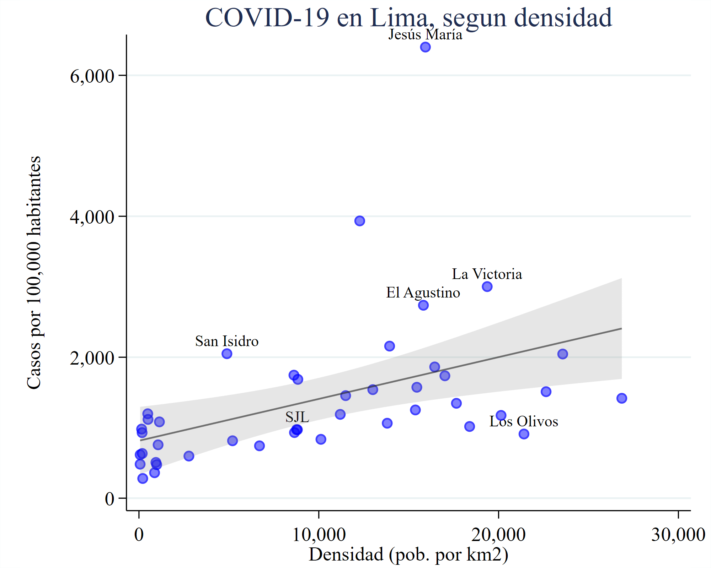

# Limpieza rapida de datos de covid de minsa

*(ultima descarga de MINSA: 23may2020)*

## Ejemplos de analisis

## Fuentes

- Thread: https://twitter.com/Jlincio/status/1263642080968089601
- Casos positivos: https://www.datosabiertos.gob.pe/dataset/casos-positivos-por-covid-19-ministerio-de-salud-minsa
- Fallecidos por COVID-19: https://www.datosabiertos.gob.pe/dataset/fallecidos-por-covid-19-ministerio-de-salud-minsa
- Ubigeos 2019 de: https://github.com/ernestorivero/Ubigeo-Peru
- Poblacion por distrito: https://www.inei.gob.pe/estadisticas/indice-tematico/poblacion-y-vivienda/ . Esta solo al 2015 y en Excel, asi que use esta que es mas accesible: https://github.com/geodir/ubigeo-peru/blob/master/geodir-ubigeo-inei.csv (pero la del INEI tiene por rangos de edad, que permitiria calcular poblacion vulnerable)
- Concordancia de ubigeos: https://github.com/CONCYTEC/ubigeo-peru/blob/master/equivalencia-ubigeos-oti-concytec.csv

## Pasos

*(El codigo esta en Stata, que lamentablemente no es de codigo abierto)*

1. Actualizar datos de MINSA
2. Ejecutar programa `create_all.do`

## Algunas observaciones

- Las fechas se reportan a veces en formatos incompatibles (por ejemplo 2019-12-31 vs 31/12/2019)
- Hay fechas invalidas (de nacimiento, de examen, etc.)
- Hay combinaciones de departamento, provincia, distrito que no tienen correspondencia con ubigeos. En la mayoria de casos el error es obvio y fue corregido
- Los duplicados fueron removidos
- Cuando una persona tiene multiples pruebas positivas, solo guarde la primera

